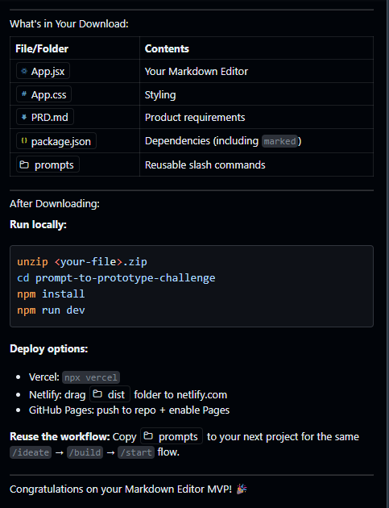

# Markdown Writer

A distraction-free markdown editor with live preview, built with React, Vite, and Electron. Features Fluent UI styling, CodeMirror 6 editing, and MSIX packaging for Windows.



## Features

- **Live preview** — Split-pane editor with real-time rendered markdown
- **CodeMirror 6 editor** — Syntax highlighting, line numbers, undo history, search
- **Fluent UI** — Native-feeling interface with platform-adaptive styling (Mica on Windows, vibrancy on macOS)
- **Dark mode** — System detection with manual toggle, persisted to localStorage
- **File operations** — Open, Save, Save As with dirty-state tracking and unsaved-changes dialog
- **Export** — Standalone HTML and PDF export via File menu
- **Auto-save** — Drafts saved to localStorage with debounced writes; crash recovery on restart
- **Word & character count** — Status bar with live word/char counts and selection stats
- **Localization** — English and Spanish with framework for adding more languages
- **Keyboard shortcuts** — Standard accelerators (Ctrl/⌘+S, O, N, B, I, Shift+D)
- **MSIX packaging** — Windows packaging with winapp CLI, file associations for `.md`/`.markdown`

## Getting Started

### Prerequisites

- [Node.js](https://nodejs.org/) 18+
- npm (included with Node.js)

### Install

```bash
git clone <repo-url>
cd markdown-writer
npm install
```

### Development

```bash
# Web only (browser)
npm run dev

# Electron desktop app
npm run electron:dev
```

### Build & Package

```bash
# Production web build
npm run build

# Electron installer (NSIS)
npm run electron:build

# Windows MSIX package
npm run msix:build
```

## Project Structure

```
├── electron/
│   ├── main.cjs          # Electron main process (menus, IPC, file/export handlers)
│   ├── preload.cjs        # Context bridge (secure IPC API)
│   └── i18n-main.cjs      # Main process i18n config
├── src/
│   ├── App.jsx            # Main React component (UI, state, handlers)
│   ├── App.css            # Styles with CSS custom properties (light/dark themes)
│   ├── Editor.jsx         # CodeMirror 6 wrapper (imperative handle, theme switching)
│   ├── i18n.js            # Renderer i18n config (language detection, persistence)
│   └── main.jsx           # React entry point
├── locales/
│   ├── en/translation.json
│   └── es/translation.json
├── Assets/                # App icons and MSIX tile images
├── docs/                  # Additional documentation
├── appxmanifest.xml       # MSIX package manifest
├── winapp.yaml            # Windows SDK configuration
├── index.html             # HTML shell with splash screen
├── vite.config.js         # Vite configuration
└── package.json           # Dependencies, scripts, electron-builder config
```

## Scripts

| Script | Description |
|---|---|
| `npm run dev` | Start Vite dev server (browser) |
| `npm run build` | Production web build |
| `npm run electron:dev` | Run Electron with hot-reload |
| `npm run electron:preview` | Build + run Electron (no hot-reload) |
| `npm run electron:build` | Build Electron installer (NSIS) |
| `npm run electron:build:dir` | Build Electron unpacked directory |
| `npm run msix:build` | Full MSIX pipeline (build + pack + sign) |
| `npm run msix:pack` | Pack existing build as MSIX |

## MSIX Installation (Windows)

To install the dev-signed MSIX locally:

```bash
# Install the dev certificate (one-time, requires admin terminal)
npx winapp cert install ./devcert.pfx

# Then install the MSIX
# Double-click release/MarkdownWriter.msix
```

## Adding a Language

1. Copy `locales/en/translation.json` to `locales/<code>/translation.json`
2. Translate all values
3. Add the language to `SUPPORTED_LANGUAGES` in `src/i18n.js`
4. Add a menu entry in `buildMenu()` in `electron/main.cjs`

## Tech Stack

- **Frontend**: React 18, Vite 5, CodeMirror 6, Fluent UI v9
- **Desktop**: Electron 35, electron-builder
- **Markdown**: marked + DOMPurify (XSS protection)
- **i18n**: i18next + react-i18next
- **Packaging**: winapp CLI (MSIX), electron-builder (NSIS/DMG)

## License

MIT
